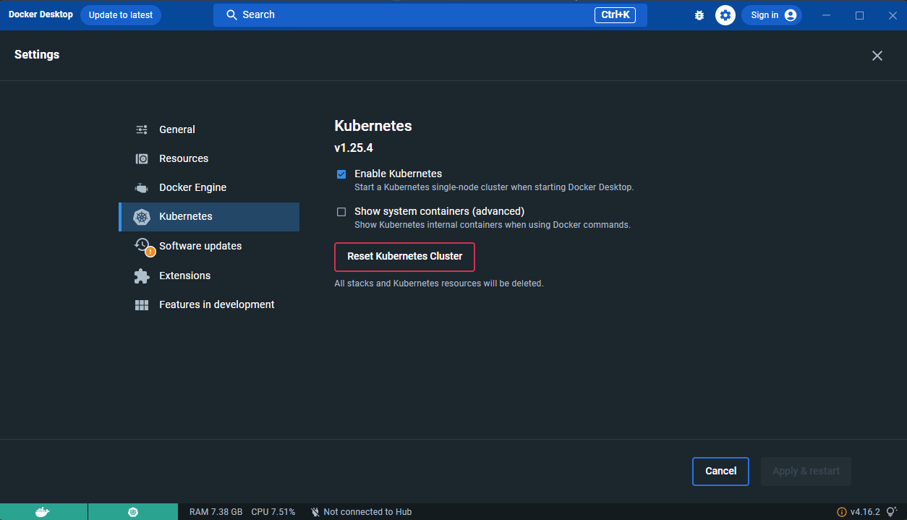
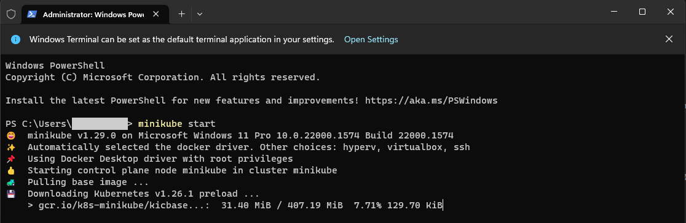
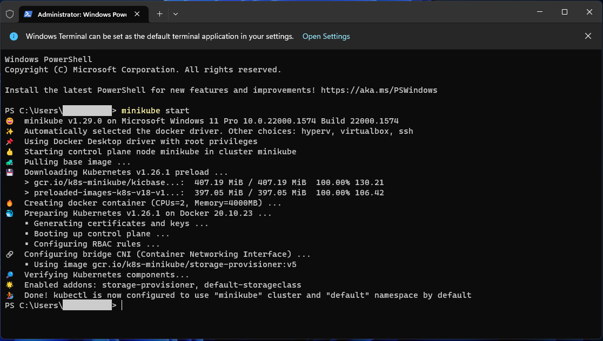
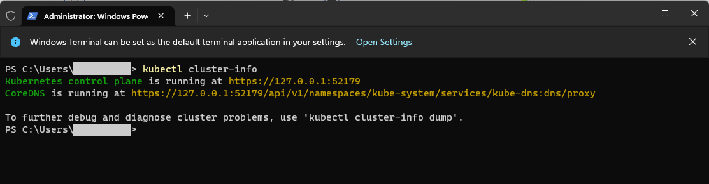
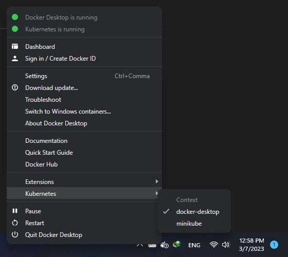

# Docker Installation
You'll need to have [Docker installed](https://docs.docker.com/get-docker/).
It's available on Windows, macOS and most distros of Linux. 

System requirements
To install Docker Desktop successfully, your Linux host must meet the following general requirements:

- 64-bit kernel and CPU support for virtualization.
- KVM virtualization support. Follow the KVM virtualization support instructions to check if the KVM kernel modules are enabled and how to provide access to the kvm device.
- QEMU must be version 5.2 or newer. We recommend upgrading to the latest version.
- systemd init system.
- Gnome, KDE, or MATE Desktop environment.
- For many Linux distros, the Gnome environment does not support tray icons. To add support for tray icons, you need to install a Gnome extension. For example, AppIndicator.
- At least 4 GB of RAM.
- Enable configuring ID mapping in user namespaces, see File sharing.

Docker Desktop for Linux runs a Virtual Machine (VM). For more information on why, see Why Docker Desktop for Linux runs a VM.

If you're using Windows, it will be expected that you have to install wsl too. [WSL or WSL
2](https://nickjanetakis.com/blog/a-linux-dev-environment-on-windows-with-wsl-2-docker-desktop-and-more).

That's because we're going to be running shell commands. You can always modify
these commands for PowerShell if you want.


# Kubernetes Cluster Setup
in order to run the kubernetes cluster you need to install one of the following providers for dev environment
## Docker Desktop (default)
docker desktop already has support for windows,linux and mac so its already there all you have to do is to go to docker desktop settings and enable kubernetes, and wait till installation is completed. after that you will see another icon appears beside docker and shows the status of the kubernetes too.
<div align="center" ></div>


## Minikube Installation (Optional)
Minikube is Kubernetes tool. It allows you to run Kubernetes locally on your computer. It runs as a single-node Kubernetes cluster within your local computer, making it easy to develop the Kubernetes app.
you can follow the instructions provided here to install it based on your os.

<https://minikube.sigs.k8s.io/docs/start/>

What you’ll need
- 2 CPUs or more
- 2GB of free memory
- 20GB of free disk space
- Internet connection
- Container or virtual machine manager, such as: Docker, QEMU, Hyperkit, Hyper-V, KVM, Parallels, Podman, VirtualBox, or VMware Fusion/Workstation


after installation you have to run the minikube and set it up for usage, so in order to do that just run the following command:
```shell
minikube start
```
<div align="center" ></div>

**Note:** if you want to change the default driver for minikube you can pass the argument like this:
```shell
minikube start --driver=virtualbox
```
which will setup minikube with virtualbox as the default driver. for more information see the documentation in here: <https://minikube.sigs.k8s.io/docs/drivers/>. by default we will use docker.

when its done you will see the details of the steps and informations.

<div align="center" ></div>


## KubeCTL Installation
The Kubernetes command-line tool, kubectl, allows you to run commands against Kubernetes clusters. You can use kubectl to deploy applications, inspect and manage cluster resources, and view logs. For more information including a complete list of kubectl operations, see the kubectl reference documentation provided here:

<https://kubernetes.io/docs/reference/kubectl/>

for installing kubectl, you can head to the link down below and choose the right os and start the installation steps:

<https://kubernetes.io/docs/tasks/tools/>

**Note:** for windows users after downloading the file you have to put it in a folder inside C directory and then just add the path to environment variables of the system. then you can access and test it with the following command: ```shell  kubectl version --client```


## Test Kubectl connection to cluster

Once you have the PATH ready, run the following command to check if your set Kubectl is ready to execute Kubernetes commands:
```shell 
kubectl cluster-info
```
and you should see something similar to this:
<div align="center" ></div>


## Switch Cluster
if you have already setup more than one cluster you can switch between them by docker icon in system tray and changed the kubernetes cluster from one to another.
<div align="center" ></div>

# React Setup 
## Install nodejs
in order to setup a project you need to have npm and node installed first:

1. go to nodejs.org and download the latest lts version
2. install it
3. make sure npm works correctly
4. update to latest npm with ```npm install -g npm@latest```


## Install Vite and Setup project
for installing and creating react app use vite, but in order to do that we will use yarn package manager
```
npm create vite
```
then it will start initiating installation, and will ask you the name of the project which i call it app.then i will choose javascript as the language for creating project. (choose based on your way of working)
```
Need to install the following packages:
  create-vite@4.3.0
Ok to proceed? (y) y
√ Project name: ... app
√ Select a framework: » React
√ Select a variant: » JavaScript

Scaffolding project in C:\Users\Ali\Documents\GitHub\React-Blog-App\app...

Done. Now run:

  cd app
  npm install
  npm run dev

```

## Start the app
in order to install the dependencies first go inside the project directory then use the command ```npm install``` for installing the packages. and in order to run the project in each mode use the following commands:
```
# installing packages
npm install

# running the project in dev mode
npm run dev

# for showing the page outside of local
npm run dev -- --host

# building for production
npm run build
```
after successful run you can see the page in the following address:

<http://localhost:5173/>

# FastAPI Setup

## Build everything

*The first time you run this it's going to take 5-10 minutes depending on your
internet connection speed and computer's hardware specs. That's because it's
going to download a few Docker images and build the Python + requirements dependencies.*

```bash
docker compose up --build
```

Now that everything is built and running we can treat it like any other FastAPI
app. Visit <http://localhost:8000/swagger> in your favorite browser.

**Note:** If you receive an error about a port being in use? Chances are it's because
something on your machine is already running on port 8000. then you have to change the docker-compose.yml file according to your needs.


# Deployment

## Build docker image
for deployment purposes you need to build the docker image, so it can be used inside the k8s deployment as a refrence.
there are two options here: 

- build locally and push to docker hub
- build locally and use it

the correct way is to build and push to docker hub but as we may be some restrictions just build and use it.
remember that we are using a special naming so follow the commands below to create the images.
after that you can either decide to push it to hub or not.

for building django app:
```shell
docker build -t fastapi_app -f ./dockerfiles/prod/fastapi/Dockerfile .
```

and for nginx app:
```shell
docker build -t nginx_app -f ./dockerfiles/prod/nginx/Dockerfile .
```
if you want to push it to the hub firstly, login to docker with the following command:
```shell
docker login -u username -p password
```

after that just push your apps with the following command:
```shell
docker push [USERNAME]/[IMAGE-NAME]:[TAG]
```

## Deploy with Kubectl
in order to deploy the sample project i have provided 3 services inside the ```k8s``` directory:

- fastapi
- nginx


in order to deploy the application using the local cluster you need to apply or create them by kubectl, which will communicate with the cluster and create the needed pods,services,deployments and etc. so just follow the instructions:


### deploy fastapi
our main service is our fastapi application which handles communications between ai app and frontent

you need to deploy the pod by the deployment:
```shell
kubectl apply -f ./k8s/django/deployment.yml
```

and lastly to make the service accessible by nginx we need to have a service to be able to connect to:
```shell
kubectl apply -f ./k8s/django/service.yml
```
at the end you will end up having the django app up and running.
if you list all the details you can see that the django app and database is running at this point.
you can change the default configs and update each one.

### deploy nginx
first you need to deploy the pod by the deployment, nginx will be running with 2 replicas:
```shell
kubectl apply -f ./k8s/nginx/deployment.yml
```

and also apply the service so we can access the django app though nginx,which will be in load balance mode:
```shell
kubectl apply -f ./k8s/nginx/service.yml
```
at the end you will end up having the all the needed services to run the whole application.


# Application Demo
you can find the demo in docs directory